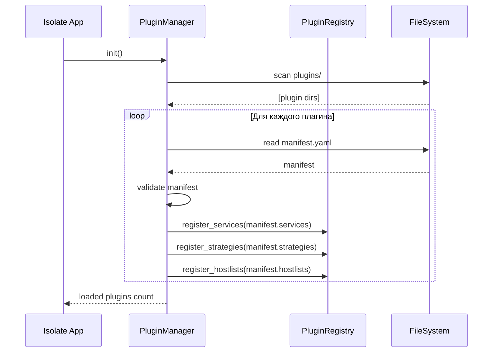
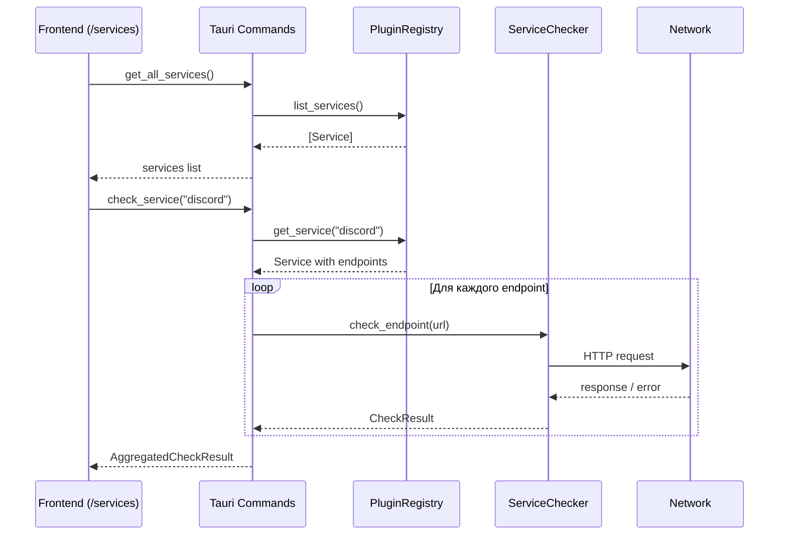
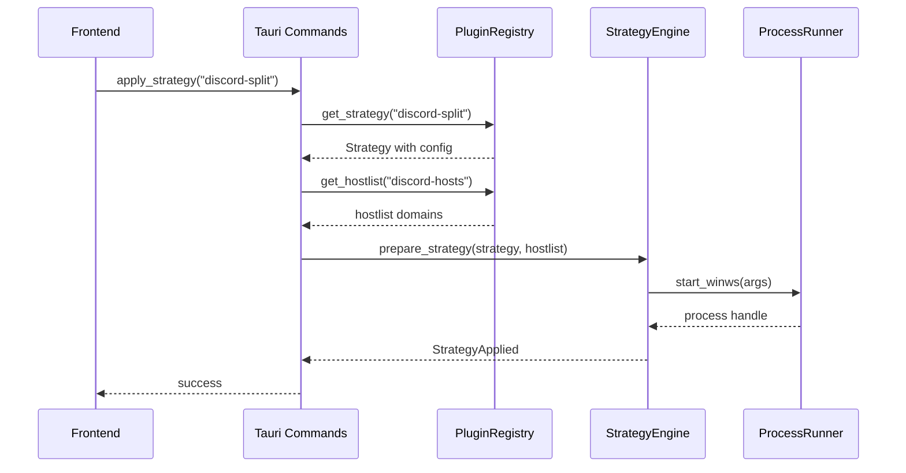

# Архитектура системы плагинов Isolate

## Концепция

Система плагинов Isolate построена на принципе **декларативной регистрации**:
- Плагины **НЕ добавляют** свои вкладки/страницы в UI
- Плагины **РЕГИСТРИРУЮТ** сущности (сервисы, стратегии, хостлисты) через manifest
- Встроенные страницы приложения **АГРЕГИРУЮТ** данные от всех плагинов

```
┌─────────────────────────────────────────────────────────────────┐
│                        Isolate App                              │
├─────────────────────────────────────────────────────────────────┤
│  Встроенные страницы:                                           │
│  ┌─────────────┐ ┌─────────────┐ ┌─────────────┐               │
│  │  /services  │ │ /strategies │ │  /plugins   │               │
│  │  Сервисы    │ │  Стратегии  │ │  Плагины    │               │
│  └──────┬──────┘ └──────┬──────┘ └──────┬──────┘               │
│         │               │               │                       │
│         ▼               ▼               ▼                       │
│  ┌─────────────────────────────────────────────────────────┐   │
│  │              Plugin Registry (Backend)                   │   │
│  │  - Загружает плагины                                     │   │
│  │  - Собирает все services, strategies, hostlists          │   │
│  │  - Предоставляет API для frontend                        │   │
│  └─────────────────────────────────────────────────────────┘   │
│         ▲               ▲               ▲                       │
│         │               │               │                       │
│  ┌──────┴──────┐ ┌──────┴──────┐ ┌──────┴──────┐               │
│  │   Plugin    │ │   Plugin    │ │   Plugin    │               │
│  │  Discord    │ │  YouTube    │ │  Telegram   │               │
│  └─────────────┘ └─────────────┘ └─────────────┘               │
└─────────────────────────────────────────────────────────────────┘
```

## Типы плагинов

### 1. service-checker — Проверка доступности сервисов

Регистрирует сервис для мониторинга на странице `/services`.

### 2. strategy-provider — Поставщик стратегий обхода

Добавляет стратегии в общий пул на странице `/strategies`.

### 3. hostlist-provider — Поставщик списков хостов

Добавляет списки доменов для использования в стратегиях.

---

## Manifest Schema

### Базовая структура

```yaml
# manifest.yaml
id: "plugin-id"           # Уникальный ID (kebab-case)
name: "Plugin Name"       # Отображаемое имя
version: "1.0.0"          # Semver
author: "Author Name"
description: "Описание плагина"
icon: "🎮"                # Emoji или путь к иконке

# Тип плагина (один или несколько)
type:
  - service-checker
  - strategy-provider
  - hostlist-provider

# Разрешения
permissions:
  http:                   # Разрешённые домены для HTTP
    - "discord.com"
    - "*.discordapp.com"
  filesystem: false       # Доступ к файловой системе
  process: false          # Запуск процессов

# Вклад плагина (зависит от типа)
contributes:
  services: []            # Для service-checker
  strategies: []          # Для strategy-provider
  hostlists: []           # Для hostlist-provider
```

---

## Service-Checker Plugin

### Manifest пример

```yaml
# plugins/discord-checker/manifest.yaml
id: "discord-checker"
name: "Discord Checker"
version: "1.0.0"
author: "Isolate Team"
description: "Проверка доступности Discord"
icon: "🎮"

type:
  - service-checker

permissions:
  http:
    - "discord.com"
    - "*.discordapp.com"
    - "discordstatus.com"

contributes:
  services:
    - id: "discord"
      name: "Discord"
      icon: "🎮"
      category: "communication"    # communication, media, social, gaming, other
      description: "Голосовой и текстовый мессенджер для геймеров"
      endpoints:
        - id: "api"
          name: "Discord API"
          url: "https://discord.com/api/v10/gateway"
          method: "GET"
          timeout: 5000
          expected_status: [200]
        - id: "cdn"
          name: "Discord CDN"
          url: "https://cdn.discordapp.com/"
          method: "HEAD"
          timeout: 5000
        - id: "status"
          name: "Status Page"
          url: "https://discordstatus.com/api/v2/status.json"
          method: "GET"
          timeout: 5000
```

### JSON альтернатива

```json
{
  "id": "discord-checker",
  "name": "Discord Checker",
  "version": "1.0.0",
  "author": "Isolate Team",
  "description": "Проверка доступности Discord",
  "icon": "🎮",
  "type": ["service-checker"],
  "permissions": {
    "http": ["discord.com", "*.discordapp.com", "discordstatus.com"]
  },
  "contributes": {
    "services": [
      {
        "id": "discord",
        "name": "Discord",
        "icon": "🎮",
        "category": "communication",
        "description": "Голосовой и текстовой мессенджер",
        "endpoints": [
          {
            "id": "api",
            "name": "Discord API",
            "url": "https://discord.com/api/v10/gateway",
            "method": "GET",
            "timeout": 5000,
            "expected_status": [200]
          },
          {
            "id": "cdn",
            "name": "Discord CDN",
            "url": "https://cdn.discordapp.com/",
            "method": "HEAD",
            "timeout": 5000
          }
        ]
      }
    ]
  }
}
```

### Категории сервисов

| Категория       | Описание                    | Примеры                    |
|-----------------|-----------------------------|-----------------------------|
| communication   | Мессенджеры, VoIP           | Discord, Telegram, WhatsApp |
| media           | Видео, музыка, стриминг     | YouTube, Twitch, Spotify    |
| social          | Социальные сети             | Twitter/X, Instagram        |
| gaming          | Игровые платформы           | Steam, Epic Games           |
| development     | Инструменты разработки      | GitHub, GitLab              |
| other           | Прочее                      | Любые другие сервисы        |

---

## Strategy-Provider Plugin

### Manifest пример

```yaml
# plugins/zapret-youtube/manifest.yaml
id: "zapret-youtube"
name: "YouTube Zapret Strategies"
version: "1.0.0"
author: "Isolate Team"
description: "Стратегии обхода для YouTube через Zapret"
icon: "📺"

type:
  - strategy-provider

permissions:
  process: true           # Нужен для запуска winws

contributes:
  strategies:
    - id: "youtube-split-hello"
      name: "YouTube Split TLS Hello"
      description: "Разбивает TLS ClientHello для обхода DPI"
      family: "zapret"
      engine: "winws"
      target_services:    # Для каких сервисов предназначена
        - "youtube"
      priority: 10        # Порядок тестирования (меньше = раньше)
      config:
        args:
          - "--wf-tcp=443"
          - "--wf-l3=ipv4"
          - "--split-pos=2"
          - "--hostlist-auto"
        hostlist: "youtube-hosts"   # Ссылка на hostlist
        
    - id: "youtube-fake-disorder"
      name: "YouTube Fake + Disorder"
      description: "Fake пакет + перемешивание"
      family: "zapret"
      engine: "winws"
      target_services:
        - "youtube"
      priority: 20
      config:
        args:
          - "--wf-tcp=443"
          - "--dpi-desync=fake,disorder2"
          - "--dpi-desync-ttl=3"
```

### Семейства стратегий

| Family    | Engine    | Описание                          | Parallel Safe |
|-----------|-----------|-----------------------------------|---------------|
| zapret    | winws     | DPI обход через WinDivert         | ❌ Нет        |
| vless     | sing-box  | VLESS прокси                      | ✅ Да         |
| shadowsocks| sing-box | Shadowsocks прокси                | ✅ Да         |
| custom    | custom    | Пользовательские скрипты          | ⚠️ Зависит   |

---

## Hostlist-Provider Plugin

### Manifest пример

```yaml
# plugins/youtube-hostlist/manifest.yaml
id: "youtube-hostlist"
name: "YouTube Hostlist"
version: "1.0.0"
author: "Isolate Team"
description: "Списки доменов YouTube и Google Video"
icon: "📋"

type:
  - hostlist-provider

contributes:
  hostlists:
    - id: "youtube-hosts"
      name: "YouTube Domains"
      description: "Основные домены YouTube"
      format: "plain"           # plain, regex, wildcard
      update_url: null          # URL для автообновления (опционально)
      update_interval: 86400    # Интервал обновления в секундах
      domains:
        - "youtube.com"
        - "www.youtube.com"
        - "m.youtube.com"
        - "youtu.be"
        - "googlevideo.com"
        - "*.googlevideo.com"
        - "ytimg.com"
        - "*.ytimg.com"
        - "ggpht.com"
        - "*.ggpht.com"
        
    - id: "youtube-api"
      name: "YouTube API"
      description: "API домены YouTube"
      format: "plain"
      domains:
        - "www.googleapis.com"
        - "youtube.googleapis.com"
```

### Форматы hostlist

| Format   | Описание                              | Пример                    |
|----------|---------------------------------------|---------------------------|
| plain    | Точное совпадение домена              | `youtube.com`             |
| wildcard | Wildcard поддомены                    | `*.youtube.com`           |
| regex    | Регулярные выражения                  | `.*\.googlevideo\.com$`   |

---

## Комбинированный плагин

Плагин может реализовывать несколько типов одновременно:

```yaml
# plugins/discord-full/manifest.yaml
id: "discord-full"
name: "Discord Full Support"
version: "1.0.0"
author: "Isolate Team"
description: "Полная поддержка Discord: проверка + стратегии + хосты"
icon: "🎮"

type:
  - service-checker
  - strategy-provider
  - hostlist-provider

permissions:
  http:
    - "discord.com"
    - "*.discordapp.com"
  process: true

contributes:
  services:
    - id: "discord"
      name: "Discord"
      icon: "🎮"
      category: "communication"
      endpoints:
        - id: "api"
          name: "API"
          url: "https://discord.com/api/v10/gateway"
        - id: "cdn"
          name: "CDN"
          url: "https://cdn.discordapp.com/"

  strategies:
    - id: "discord-split"
      name: "Discord Split"
      family: "zapret"
      engine: "winws"
      target_services: ["discord"]
      priority: 10
      config:
        args: ["--wf-tcp=443", "--split-pos=2"]
        hostlist: "discord-hosts"

  hostlists:
    - id: "discord-hosts"
      name: "Discord Domains"
      format: "plain"
      domains:
        - "discord.com"
        - "*.discord.com"
        - "discordapp.com"
        - "*.discordapp.com"
        - "discord.gg"
```

---

## Страница Сервисы (`/services`)

### Назначение

Централизованный мониторинг доступности всех сервисов, зарегистрированных плагинами.

### UI компоненты

```
┌─────────────────────────────────────────────────────────────────┐
│  🌐 Сервисы                              [🔄 Проверить все]     │
├─────────────────────────────────────────────────────────────────┤
│                                                                 │
│  📱 Коммуникации                                                │
│  ┌─────────────────┐ ┌─────────────────┐ ┌─────────────────┐   │
│  │ 🎮 Discord      │ │ ✈️ Telegram     │ │ 📱 WhatsApp     │   │
│  │ ✅ Доступен     │ │ ✅ Доступен     │ │ ⚠️ Частично    │   │
│  │ 45ms            │ │ 120ms           │ │ 89ms            │   │
│  │ [Подробнее]     │ │ [Подробнее]     │ │ [Подробнее]     │   │
│  └─────────────────┘ └─────────────────┘ └─────────────────┘   │
│                                                                 │
│  🎬 Медиа                                                       │
│  ┌─────────────────┐ ┌─────────────────┐                       │
│  │ 📺 YouTube      │ │ 🎵 Spotify      │                       │
│  │ ❌ Недоступен   │ │ ✅ Доступен     │                       │
│  │ Timeout         │ │ 67ms            │                       │
│  │ [Подробнее]     │ │ [Подробнее]     │                       │
│  └─────────────────┘ └─────────────────┘                       │
│                                                                 │
└─────────────────────────────────────────────────────────────────┘
```

### Карточка сервиса (развёрнутая)

```
┌─────────────────────────────────────────────────────────────────┐
│  🎮 Discord                                    ✅ Доступен      │
├─────────────────────────────────────────────────────────────────┤
│  Голосовой и текстовый мессенджер для геймеров                  │
│                                                                 │
│  Endpoints:                                                     │
│  ┌─────────────────────────────────────────────────────────┐   │
│  │ ✅ Discord API     https://discord.com/api    45ms      │   │
│  │ ✅ Discord CDN     https://cdn.discordapp.com 52ms      │   │
│  │ ✅ Status Page     https://discordstatus.com  38ms      │   │
│  └─────────────────────────────────────────────────────────┘   │
│                                                                 │
│  Средняя задержка: 45ms                                         │
│  Последняя проверка: 14:32:15                                   │
│                                                                 │
│  Рекомендуемые стратегии: Discord Split, Discord Fake           │
│                                                                 │
│  [🔍 Проверить] [⚙️ Настроить стратегию]                        │
└─────────────────────────────────────────────────────────────────┘
```

### Статусы сервиса

| Статус       | Иконка | Условие                                    |
|--------------|--------|---------------------------------------------|
| Доступен     | ✅     | Все endpoints доступны                      |
| Частично     | ⚠️     | Часть endpoints доступна                    |
| Недоступен   | ❌     | Все endpoints недоступны                    |
| Проверяется  | 🔄     | Идёт проверка                               |
| Не проверен  | ⏸️     | Ещё не проверялся                           |

---

## Страница Плагины (`/plugins`)

### Назначение

Управление установленными плагинами. **НЕ показывает** функционал плагинов — только метаинформацию и контроль.

### UI компоненты

```
┌─────────────────────────────────────────────────────────────────┐
│  🧩 Плагины                              [📁 Папка] [🔄 Обновить]│
├─────────────────────────────────────────────────────────────────┤
│                                                                 │
│  ┌─────────────────────────────────────────────────────────┐   │
│  │ 🎮 Discord Full Support              v1.0.0    [✓] [🗑️] │   │
│  │ Isolate Team                                             │   │
│  │ Полная поддержка Discord                                 │   │
│  │                                                          │   │
│  │ Добавляет:                                               │   │
│  │ • 1 сервис (Discord)                                     │   │
│  │ • 2 стратегии (Discord Split, Discord Fake)              │   │
│  │ • 1 hostlist (Discord Domains)                           │   │
│  │                                                          │   │
│  │ Разрешения: 🌐 HTTP, ⚙️ Процессы                         │   │
│  └─────────────────────────────────────────────────────────┘   │
│                                                                 │
│  ┌─────────────────────────────────────────────────────────┐   │
│  │ 📺 YouTube Checker                   v1.0.0    [✓] [🗑️] │   │
│  │ Isolate Team                                             │   │
│  │ Проверка доступности YouTube                             │   │
│  │                                                          │   │
│  │ Добавляет:                                               │   │
│  │ • 1 сервис (YouTube)                                     │   │
│  │                                                          │   │
│  │ Разрешения: 🌐 HTTP                                      │   │
│  └─────────────────────────────────────────────────────────┘   │
│                                                                 │
└─────────────────────────────────────────────────────────────────┘
```

### Действия с плагинами

| Действие    | Описание                                      |
|-------------|-----------------------------------------------|
| Включить    | Активировать плагин, загрузить его вклад      |
| Отключить   | Деактивировать, убрать вклад из реестра       |
| Удалить     | Удалить папку плагина                         |
| Обновить    | Перезагрузить manifest и код                  |

---

## Data Flow

### Диаграмма загрузки плагинов



### Диаграмма проверки сервисов



### Диаграмма применения стратегии



---

## Backend Architecture

### Структура модулей

```
src-tauri/src/
├── plugins/
│   ├── mod.rs              # Plugin Manager
│   ├── manifest.rs         # Manifest parsing & validation
│   ├── registry.rs         # Plugin Registry (services, strategies, hostlists)
│   ├── checker.rs          # Service checking logic
│   └── types.rs            # Shared types
├── commands/
│   ├── plugins.rs          # Tauri commands для плагинов
│   ├── services.rs         # Tauri commands для сервисов
│   └── ...
└── core/
    └── ...
```

### Plugin Registry

```rust
/// Центральный реестр всех вкладов от плагинов
pub struct PluginRegistry {
    /// Все зарегистрированные сервисы
    services: HashMap<String, RegisteredService>,
    /// Все зарегистрированные стратегии
    strategies: HashMap<String, RegisteredStrategy>,
    /// Все зарегистрированные hostlists
    hostlists: HashMap<String, RegisteredHostlist>,
    /// Связь: какой плагин что добавил
    contributions: HashMap<String, PluginContributions>,
}

#[derive(Debug, Clone)]
pub struct RegisteredService {
    pub id: String,
    pub name: String,
    pub icon: String,
    pub category: ServiceCategory,
    pub description: Option<String>,
    pub endpoints: Vec<ServiceEndpoint>,
    pub source_plugin: String,  // ID плагина-источника
}

#[derive(Debug, Clone)]
pub struct RegisteredStrategy {
    pub id: String,
    pub name: String,
    pub family: StrategyFamily,
    pub engine: String,
    pub target_services: Vec<String>,
    pub priority: i32,
    pub config: StrategyConfig,
    pub source_plugin: String,
}

#[derive(Debug, Clone)]
pub struct RegisteredHostlist {
    pub id: String,
    pub name: String,
    pub format: HostlistFormat,
    pub domains: Vec<String>,
    pub source_plugin: String,
}
```

### Tauri Commands

```rust
// Сервисы
#[tauri::command]
async fn get_all_services(registry: State<PluginRegistry>) -> Vec<ServiceInfo>;

#[tauri::command]
async fn get_services_by_category(
    registry: State<PluginRegistry>,
    category: ServiceCategory
) -> Vec<ServiceInfo>;

#[tauri::command]
async fn check_service(
    registry: State<PluginRegistry>,
    service_id: String
) -> AggregatedCheckResult;

#[tauri::command]
async fn check_all_services(
    registry: State<PluginRegistry>
) -> Vec<AggregatedCheckResult>;

// Плагины
#[tauri::command]
async fn get_plugins(manager: State<PluginManager>) -> Vec<PluginInfo>;

#[tauri::command]
async fn enable_plugin(manager: State<PluginManager>, plugin_id: String) -> Result<()>;

#[tauri::command]
async fn disable_plugin(manager: State<PluginManager>, plugin_id: String) -> Result<()>;

#[tauri::command]
async fn get_plugin_contributions(
    registry: State<PluginRegistry>,
    plugin_id: String
) -> PluginContributions;
```

---

## Frontend Architecture

### Stores

```typescript
// src/lib/stores/services.ts
import { writable, derived } from 'svelte/store';

interface Service {
  id: string;
  name: string;
  icon: string;
  category: ServiceCategory;
  description?: string;
  endpoints: ServiceEndpoint[];
  sourcePlugin: string;
}

interface ServiceCheckState {
  status: 'idle' | 'checking' | 'checked';
  result?: AggregatedCheckResult;
  lastCheck?: string;
}

// Все сервисы из реестра
export const services = writable<Service[]>([]);

// Состояние проверок
export const checkStates = writable<Record<string, ServiceCheckState>>({});

// Сервисы по категориям
export const servicesByCategory = derived(services, ($services) => {
  const grouped: Record<ServiceCategory, Service[]> = {};
  for (const service of $services) {
    if (!grouped[service.category]) {
      grouped[service.category] = [];
    }
    grouped[service.category].push(service);
  }
  return grouped;
});
```

### API Layer

```typescript
// src/lib/api/services.ts
import { invoke } from '@tauri-apps/api/core';

export async function getAllServices(): Promise<Service[]> {
  return invoke('get_all_services');
}

export async function checkService(serviceId: string): Promise<AggregatedCheckResult> {
  return invoke('check_service', { serviceId });
}

export async function checkAllServices(): Promise<AggregatedCheckResult[]> {
  return invoke('check_all_services');
}
```

### Типы

```typescript
// src/lib/types/services.ts
export type ServiceCategory = 
  | 'communication'
  | 'media'
  | 'social'
  | 'gaming'
  | 'development'
  | 'other';

export interface ServiceEndpoint {
  id: string;
  name: string;
  url: string;
  method?: string;
  timeout?: number;
}

export interface Service {
  id: string;
  name: string;
  icon: string;
  category: ServiceCategory;
  description?: string;
  endpoints: ServiceEndpoint[];
  sourcePlugin: string;
}

export interface CheckResult {
  accessible: boolean;
  latencyMs?: number;
  statusCode?: number;
  message?: string;
  timestamp: string;
}

export interface AggregatedCheckResult {
  serviceId: string;
  results: CheckResult[];
  accessible: boolean;
  avgLatencyMs?: number;
  successRate: number;
}
```

---

## Кэширование результатов

### Стратегия кэширования

```rust
pub struct CheckCache {
    /// Результаты проверок
    results: HashMap<String, CachedResult>,
    /// TTL по умолчанию (5 минут)
    default_ttl: Duration,
}

struct CachedResult {
    result: AggregatedCheckResult,
    cached_at: Instant,
    ttl: Duration,
}

impl CheckCache {
    /// Получить результат из кэша (если не истёк)
    pub fn get(&self, service_id: &str) -> Option<&AggregatedCheckResult> {
        self.results.get(service_id).and_then(|cached| {
            if cached.cached_at.elapsed() < cached.ttl {
                Some(&cached.result)
            } else {
                None
            }
        })
    }

    /// Сохранить результат в кэш
    pub fn set(&mut self, service_id: String, result: AggregatedCheckResult) {
        self.results.insert(service_id, CachedResult {
            result,
            cached_at: Instant::now(),
            ttl: self.default_ttl,
        });
    }

    /// Инвалидировать кэш для сервиса
    pub fn invalidate(&mut self, service_id: &str) {
        self.results.remove(service_id);
    }

    /// Очистить весь кэш
    pub fn clear(&mut self) {
        self.results.clear();
    }
}
```

### Правила кэширования

| Событие                    | Действие                           |
|----------------------------|------------------------------------|
| Проверка сервиса           | Сохранить результат (TTL 5 мин)    |
| Применение стратегии       | Инвалидировать связанные сервисы   |
| Отключение плагина         | Инвалидировать сервисы плагина     |
| Ручной запрос "Проверить"  | Игнорировать кэш, обновить         |

---

## Безопасность плагинов

### Модель разрешений

```yaml
permissions:
  http:                    # Whitelist доменов для HTTP запросов
    - "discord.com"
    - "*.discordapp.com"   # Wildcard поддомены
  filesystem: false        # Доступ к файловой системе
  process: false           # Запуск внешних процессов
  system: false            # Системная информация
  strategies: false        # Модификация стратегий
```

### Валидация manifest

```rust
fn validate_manifest(manifest: &PluginManifest) -> Result<(), ValidationError> {
    // ID должен быть kebab-case
    if !is_kebab_case(&manifest.id) {
        return Err(ValidationError::InvalidId);
    }

    // Версия должна быть semver
    if semver::Version::parse(&manifest.version).is_err() {
        return Err(ValidationError::InvalidVersion);
    }

    // HTTP домены должны быть валидными
    for domain in &manifest.permissions.http {
        if !is_valid_domain_pattern(domain) {
            return Err(ValidationError::InvalidDomain(domain.clone()));
        }
    }

    // Endpoints должны соответствовать разрешённым доменам
    for service in &manifest.contributes.services {
        for endpoint in &service.endpoints {
            if !is_url_allowed(&endpoint.url, &manifest.permissions.http) {
                return Err(ValidationError::UnauthorizedUrl(endpoint.url.clone()));
            }
        }
    }

    Ok(())
}
```

### Изоляция выполнения

- HTTP запросы проходят через backend (не напрямую из плагина)
- Плагины не имеют доступа к DOM/window
- Все операции логируются
- Таймауты на все операции (max 30 сек)

---

## Структура директорий плагинов

```
plugins/
├── discord-checker/
│   ├── manifest.yaml       # Обязательно
│   ├── icon.png            # Опционально (иначе emoji из manifest)
│   └── README.md           # Опционально
│
├── youtube-full/
│   ├── manifest.yaml
│   ├── hostlists/          # Опционально: внешние файлы hostlist
│   │   └── youtube.txt
│   └── strategies/         # Опционально: внешние файлы стратегий
│       └── youtube-split.yaml
│
└── telegram-checker/
    └── manifest.yaml
```

### Внешние файлы hostlist

Если hostlist большой, можно вынести в отдельный файл:

```yaml
# manifest.yaml
contributes:
  hostlists:
    - id: "youtube-hosts"
      name: "YouTube Domains"
      format: "plain"
      file: "hostlists/youtube.txt"   # Путь относительно папки плагина
```

```
# hostlists/youtube.txt
youtube.com
www.youtube.com
m.youtube.com
youtu.be
googlevideo.com
*.googlevideo.com
```

---

## Встроенные плагины

Isolate поставляется с набором встроенных плагинов в `configs/builtin-plugins/`:

| Плагин            | Тип              | Описание                        |
|-------------------|------------------|---------------------------------|
| discord-checker   | service-checker  | Проверка Discord                |
| youtube-checker   | service-checker  | Проверка YouTube                |
| telegram-checker  | service-checker  | Проверка Telegram               |
| zapret-strategies | strategy-provider| Базовые Zapret стратегии        |
| common-hostlists  | hostlist-provider| Общие списки доменов            |

Встроенные плагины:
- Загружаются первыми
- Не могут быть удалены (только отключены)
- Обновляются вместе с приложением

---

## Миграция с текущей системы

### Текущее состояние

- Чекеры захардкожены в `checker.rs`
- Стратегии в `configs/strategies/`
- Hostlists в `configs/hostlists/`

### План миграции

1. **Фаза 1**: Создать PluginRegistry
   - Реализовать загрузку manifest
   - Регистрация services/strategies/hostlists

2. **Фаза 2**: Конвертировать встроенные чекеры в плагины
   - Discord → `builtin-plugins/discord-checker/`
   - YouTube → `builtin-plugins/youtube-checker/`

3. **Фаза 3**: Создать страницу `/services`
   - Агрегация сервисов из реестра
   - UI проверки

4. **Фаза 4**: Обновить страницу `/plugins`
   - Показывать только управление
   - Убрать inline-чекеры

---

## Примеры готовых плагинов

### Минимальный service-checker

```yaml
# plugins/steam-checker/manifest.yaml
id: "steam-checker"
name: "Steam Checker"
version: "1.0.0"
author: "Community"
icon: "🎮"
type: [service-checker]

permissions:
  http: ["store.steampowered.com", "steamcommunity.com"]

contributes:
  services:
    - id: "steam"
      name: "Steam"
      icon: "🎮"
      category: "gaming"
      endpoints:
        - id: "store"
          name: "Steam Store"
          url: "https://store.steampowered.com/"
        - id: "community"
          name: "Steam Community"
          url: "https://steamcommunity.com/"
```

### Минимальный hostlist-provider

```yaml
# plugins/gaming-hostlist/manifest.yaml
id: "gaming-hostlist"
name: "Gaming Hostlist"
version: "1.0.0"
author: "Community"
icon: "🎮"
type: [hostlist-provider]

contributes:
  hostlists:
    - id: "gaming-platforms"
      name: "Gaming Platforms"
      format: "plain"
      domains:
        - "store.steampowered.com"
        - "steamcommunity.com"
        - "epicgames.com"
        - "*.epicgames.com"
```
