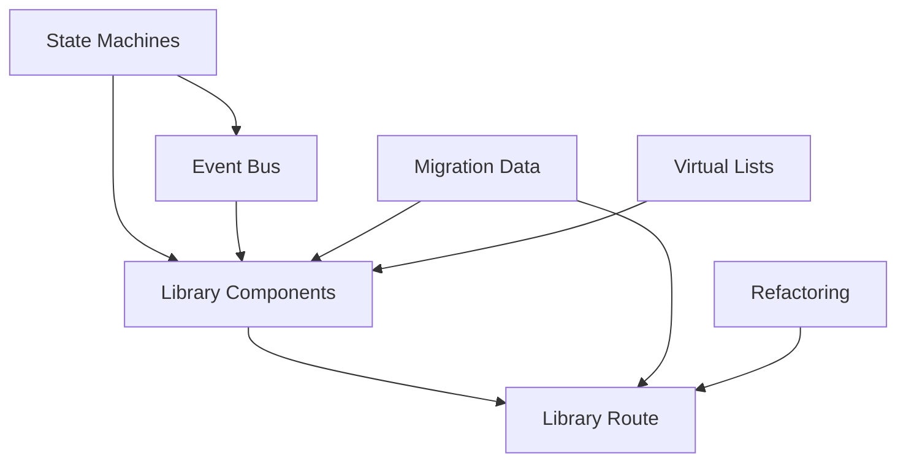

# Isolate v3 — Техническая архитектура редизайна

> Дата создания: 8 января 2026
> Статус: Планирование

---

## 📋 Оглавление

1. [State Machines для UI](#-state-machines-для-ui)
2. [Компоненты-Slot'ы](#-компоненты-slotы)
3. [Виртуализация списков](#-виртуализация-списков)
4. [Event Bus (Frontend ↔ Backend)](#-event-bus-frontend--backend)
5. [Миграция данных](#-миграция-данных)
6. [Новая структура навигации](#-новая-структура-навигации)
7. [Рефакторинг существующего кода](#-рефакторинг-существующего-кода)

---

## 🔄 State Machines для UI

### Проблема
Текущий подход с булевыми флагами (`isActive`, `isLoading`, `isOptimizing`) не отражает реальные состояния системы и не позволяет показывать промежуточные статусы (желтые индикаторы, крутилки).

### Решение

- [ ] **[L]** Создать `src/lib/state/stateMachine.ts` — универсальный state machine
  ```typescript
  // Базовые состояния для любой сущности
  type BaseState = 'idle' | 'loading' | 'active' | 'error' | 'recovering';
  
  // Расширенные состояния для защиты
  type ProtectionState = 
    | 'idle'           // Защита выключена
    | 'checking'       // Проверка текущего состояния
    | 'starting'       // Запуск стратегии
    | 'active'         // Защита работает
    | 'degraded'       // Работает с проблемами
    | 'recovering'     // Автовосстановление
    | 'stopping'       // Остановка
    | 'error';         // Критическая ошибка
  ```

- [ ] **[M]** Создать `src/lib/state/protectionMachine.ts` — state machine для защиты
  - States: `idle` → `checking` → `starting` → `active` → `degraded` → `recovering` → `error`
  - Transitions с валидацией (нельзя перейти из `idle` в `active` напрямую)
  - Контекст: `currentStrategy`, `lastError`, `degradationReason`, `recoveryAttempts`
  - Интеграция с Svelte 5 runes через `$state`

- [ ] **[M]** Создать `src/lib/state/serviceMachine.ts` — state machine для сервисов
  - States: `unknown` → `checking` → `available` → `blocked` → `error`
  - Контекст: `lastCheck`, `latency`, `errorCount`, `healthHistory`

- [ ] **[S]** Создать `src/lib/state/testMachine.ts` — state machine для тестирования
  - States: `idle` → `preparing` → `running` → `analyzing` → `complete` → `error`
  - Контекст: `currentTest`, `progress`, `results`

- [ ] **[M]** Создать `src/lib/hooks/useStateMachine.svelte.ts` — хук для использования в компонентах
  ```typescript
  export function useStateMachine<S, C>(machine: StateMachine<S, C>) {
    let state = $state(machine.initialState);
    let context = $state(machine.initialContext);
    
    function transition(event: string, payload?: unknown) {
      const next = machine.transition(state, event, payload);
      if (next) {
        state = next.state;
        context = { ...context, ...next.context };
      }
    }
    
    return {
      get state() { return state; },
      get context() { return context; },
      transition,
      can: (event: string) => machine.canTransition(state, event),
    };
  }
  ```

- [ ] **[S]** Создать `src/lib/state/index.ts` — экспорт всех машин состояний

### Файлы для создания
```
src/lib/state/
├── index.ts
├── stateMachine.ts          # Базовый класс
├── protectionMachine.ts     # Защита
├── serviceMachine.ts        # Сервисы
├── testMachine.ts           # Тестирование
└── types.ts                 # Типы состояний
```

---

## 🧩 Компоненты-Slot'ы

### Проблема
Дублирование логики между `ServiceCard`, `StrategyCard`, и будущими карточками в Library. Разные компоненты для пресетов и кастомных доменов.

### Решение

- [ ] **[L]** Создать `src/lib/components/library/LibraryCard.svelte` — универсальная карточка
  ```svelte
  <script lang="ts">
    interface Props {
      // Общие поля
      id: string;
      name: string;
      description?: string;
      icon?: string | Snippet;
      status: 'idle' | 'active' | 'checking' | 'error';
      
      // Слоты для кастомизации
      header?: Snippet;
      badges?: Snippet;
      stats?: Snippet;
      actions?: Snippet;
      
      // Callbacks
      onclick?: () => void;
      oncontextmenu?: (e: MouseEvent) => void;
    }
  </script>
  ```

- [ ] **[M]** Создать `src/lib/components/library/PresetCard.svelte` — карточка пресета
  - Использует `LibraryCard` как базу
  - Добавляет: список сервисов, рекомендации ISP, статистику использования
  - Действия: Apply, Test, Details

- [ ] **[M]** Создать `src/lib/components/library/CustomRuleCard.svelte` — карточка кастомного правила
  - Использует `LibraryCard` как базу
  - Добавляет: список доменов, редактирование, импорт/экспорт
  - Действия: Enable/Disable, Edit, Delete

- [ ] **[S]** Создать `src/lib/components/library/ServiceBadge.svelte` — бейдж сервиса
  - Иконка + название + статус
  - Компактный и полный режимы

- [ ] **[S]** Создать `src/lib/components/library/StatusIndicator.svelte` — индикатор статуса
  - Поддержка всех состояний из state machine
  - Анимации для `checking`, `recovering`
  - Цвета: зеленый (active), желтый (degraded), красный (error), серый (idle)

- [ ] **[M]** Создать `src/lib/components/library/LibraryList.svelte` — список с группировкой
  - Группировка по категориям (Presets, Custom Rules, Favorites)
  - Drag-n-drop для сортировки
  - Поиск и фильтрация

- [ ] **[S]** Создать `src/lib/components/library/LibraryFilters.svelte` — фильтры
  - По типу: All, Presets, Custom
  - По статусу: All, Active, Available, Blocked
  - По категории: YouTube, Discord, Gaming, etc.

### Файлы для создания
```
src/lib/components/library/
├── index.ts
├── LibraryCard.svelte
├── PresetCard.svelte
├── CustomRuleCard.svelte
├── ServiceBadge.svelte
├── StatusIndicator.svelte
├── LibraryList.svelte
├── LibraryFilters.svelte
└── types.ts
```

---

## 📜 Виртуализация списков

### Проблема
При большом количестве кастомных хостов (1000+) рендеринг списка будет тормозить.

### Решение

- [ ] **[L]** Создать `src/lib/components/virtual/VirtualList.svelte` — виртуальный список
  ```svelte
  <script lang="ts">
    interface Props<T> {
      items: T[];
      itemHeight: number;           // Фиксированная высота или функция
      overscan?: number;            // Количество элементов за пределами viewport
      containerHeight?: number;     // Высота контейнера (или auto)
      renderItem: Snippet<[T, number]>;  // Рендер элемента
    }
  </script>
  ```

- [ ] **[M]** Создать `src/lib/components/virtual/VirtualGrid.svelte` — виртуальная сетка
  - Для отображения карточек в grid layout
  - Адаптивное количество колонок

- [ ] **[S]** Создать `src/lib/hooks/useVirtualScroll.svelte.ts` — хук для виртуализации
  ```typescript
  export function useVirtualScroll<T>(options: {
    items: T[];
    itemHeight: number;
    containerRef: HTMLElement | null;
    overscan?: number;
  }) {
    let scrollTop = $state(0);
    let containerHeight = $state(0);
    
    let visibleRange = $derived(() => {
      const start = Math.floor(scrollTop / options.itemHeight);
      const end = Math.ceil((scrollTop + containerHeight) / options.itemHeight);
      return {
        start: Math.max(0, start - (options.overscan ?? 3)),
        end: Math.min(options.items.length, end + (options.overscan ?? 3)),
      };
    });
    
    let visibleItems = $derived(
      options.items.slice(visibleRange.start, visibleRange.end)
    );
    
    return { visibleItems, visibleRange, totalHeight: options.items.length * options.itemHeight };
  }
  ```

- [ ] **[S]** Создать `src/lib/components/virtual/VirtualHostList.svelte` — список хостов
  - Специализированный компонент для списка доменов
  - Поддержка выделения, удаления, редактирования
  - Группировка по первой букве (опционально)

### Файлы для создания
```
src/lib/components/virtual/
├── index.ts
├── VirtualList.svelte
├── VirtualGrid.svelte
├── VirtualHostList.svelte
└── types.ts

src/lib/hooks/
├── useVirtualScroll.svelte.ts
```

---

## 📡 Event Bus (Frontend ↔ Backend)

### Проблема
Текущая подписка на события Tauri разбросана по компонентам. Нет централизованного управления подписками и типизации.

### Текущее состояние
- `src/lib/types/events.ts` — уже есть типы событий и `listenTyped`
- Подписки создаются в каждом компоненте отдельно

### Решение

- [ ] **[M]** Создать `src/lib/events/eventBus.svelte.ts` — централизованный Event Bus
  ```typescript
  import { listenTyped, type TauriEventPayloadMap } from '$lib/types/events';
  
  class EventBus {
    private subscriptions = new Map<string, Set<Function>>();
    private unlisteners = new Map<string, () => void>();
    
    // Подписка на событие (автоматически создает Tauri listener при первой подписке)
    subscribe<K extends keyof TauriEventPayloadMap>(
      event: K,
      handler: (payload: TauriEventPayloadMap[K]) => void
    ): () => void;
    
    // Отписка от всех событий (для cleanup)
    unsubscribeAll(): void;
    
    // Эмит локального события (для UI-only событий)
    emit<K extends keyof LocalEventMap>(event: K, payload: LocalEventMap[K]): void;
  }
  
  export const eventBus = new EventBus();
  ```

- [ ] **[S]** Расширить `src/lib/types/events.ts` — добавить локальные события
  ```typescript
  // Локальные UI события (не Tauri)
  export interface LocalEventMap {
    'ui:theme-changed': { theme: 'light' | 'dark' | 'system' };
    'ui:sidebar-toggled': { collapsed: boolean };
    'ui:modal-opened': { id: string };
    'ui:modal-closed': { id: string };
    'ui:toast': { type: 'success' | 'error' | 'info'; message: string };
  }
  ```

- [ ] **[M]** Создать `src/lib/hooks/useEvent.svelte.ts` — хук для подписки на события
  ```typescript
  export function useEvent<K extends keyof TauriEventPayloadMap>(
    event: K,
    handler: (payload: TauriEventPayloadMap[K]) => void
  ) {
    $effect(() => {
      const unsubscribe = eventBus.subscribe(event, handler);
      return unsubscribe;
    });
  }
  ```

- [ ] **[S]** Создать `src/lib/events/eventLogger.ts` — логирование событий (dev mode)
  - Логирует все события в консоль
  - Фильтрация по типу события
  - Включается только в dev режиме

- [ ] **[M]** Добавить новые события в backend (`src-tauri/src/core/event_bus.rs`)
  ```rust
  // Новые события для state machine
  pub enum ProtectionEvent {
      StateChanged { from: String, to: String, reason: Option<String> },
      DegradationDetected { service_id: String, reason: String },
      RecoveryStarted { attempt: u32 },
      RecoveryCompleted { strategy_id: String },
      RecoveryFailed { error: String },
  }
  ```

### Файлы для создания/изменения
```
src/lib/events/
├── index.ts
├── eventBus.svelte.ts
├── eventLogger.ts
└── types.ts

src/lib/hooks/
├── useEvent.svelte.ts

src-tauri/src/core/
├── event_bus.rs (изменить)
```

---

## 🔀 Миграция данных

### Проблема
Объединение Services + Strategies в единую Library требует миграции данных и изменения моделей.

### Решение

#### Backend (Rust)

- [ ] **[L]** Создать `src-tauri/src/core/library/mod.rs` — новый модуль Library
  ```rust
  pub mod models;
  pub mod loader;
  pub mod manager;
  pub mod migration;
  ```

- [ ] **[M]** Создать `src-tauri/src/core/library/models.rs` — новые модели
  ```rust
  #[derive(Debug, Clone, Serialize, Deserialize)]
  pub struct LibraryItem {
      pub id: String,
      pub name: String,
      pub description: Option<String>,
      pub item_type: LibraryItemType,
      pub services: Vec<String>,        // ID сервисов
      pub strategy_id: Option<String>,  // Для пресетов
      pub custom_hosts: Vec<String>,    // Для кастомных правил
      pub enabled: bool,
      pub favorite: bool,
      pub created_at: DateTime<Utc>,
      pub updated_at: DateTime<Utc>,
  }
  
  #[derive(Debug, Clone, Serialize, Deserialize)]
  pub enum LibraryItemType {
      Preset,      // Готовый пресет (YouTube, Discord, etc.)
      CustomRule,  // Кастомное правило пользователя
      Imported,    // Импортированный список
  }
  ```

- [ ] **[M]** Создать `src-tauri/src/core/library/migration.rs` — миграция данных
  - Конвертация старых Services в LibraryItem (type: Preset)
  - Сохранение пользовательских настроек
  - Версионирование схемы данных

- [ ] **[M]** Создать `src-tauri/src/commands/library.rs` — новые команды
  ```rust
  #[tauri::command]
  pub async fn get_library_items() -> Result<Vec<LibraryItem>, String>;
  
  #[tauri::command]
  pub async fn create_custom_rule(name: String, hosts: Vec<String>) -> Result<LibraryItem, String>;
  
  #[tauri::command]
  pub async fn update_library_item(id: String, updates: LibraryItemUpdate) -> Result<LibraryItem, String>;
  
  #[tauri::command]
  pub async fn delete_library_item(id: String) -> Result<(), String>;
  
  #[tauri::command]
  pub async fn import_hosts(source: String) -> Result<Vec<String>, String>;
  
  #[tauri::command]
  pub async fn export_hosts(item_id: String) -> Result<String, String>;
  ```

#### Frontend (TypeScript)

- [ ] **[M]** Создать `src/lib/api/library.ts` — API для Library
  ```typescript
  export interface LibraryItem {
    id: string;
    name: string;
    description?: string;
    type: 'preset' | 'custom' | 'imported';
    services: string[];
    strategyId?: string;
    customHosts: string[];
    enabled: boolean;
    favorite: boolean;
    createdAt: string;
    updatedAt: string;
  }
  
  export async function getLibraryItems(): Promise<LibraryItem[]>;
  export async function createCustomRule(name: string, hosts: string[]): Promise<LibraryItem>;
  export async function updateLibraryItem(id: string, updates: Partial<LibraryItem>): Promise<LibraryItem>;
  export async function deleteLibraryItem(id: string): Promise<void>;
  export async function importHosts(source: string): Promise<string[]>;
  export async function exportHosts(itemId: string): Promise<string>;
  ```

- [ ] **[M]** Создать `src/lib/stores/library.svelte.ts` — store для Library
  ```typescript
  class LibraryStore {
    items = $state<LibraryItem[]>([]);
    loading = $state(false);
    error = $state<string | null>(null);
    
    // Derived
    presets = $derived(this.items.filter(i => i.type === 'preset'));
    customRules = $derived(this.items.filter(i => i.type === 'custom'));
    favorites = $derived(this.items.filter(i => i.favorite));
    
    async load(): Promise<void>;
    async create(item: Partial<LibraryItem>): Promise<void>;
    async update(id: string, updates: Partial<LibraryItem>): Promise<void>;
    async delete(id: string): Promise<void>;
  }
  
  export const libraryStore = new LibraryStore();
  ```

### Файлы для создания
```
src-tauri/src/core/library/
├── mod.rs
├── models.rs
├── loader.rs
├── manager.rs
└── migration.rs

src-tauri/src/commands/
├── library.rs

src/lib/api/
├── library.ts

src/lib/stores/
├── library.svelte.ts
```

---

## 🧭 Новая структура навигации

### Текущие routes
```
/                    → Dashboard
/services            → Управление сервисами
/strategies          → Стратегии обхода
/orchestra           → Оркестрация
/network             → Сетевые настройки
/logs                → Логи
/diagnostics         → Диагностика
/settings            → Настройки
/plugins             → Плагины
/testing             → Тестирование
/onboarding          → Онбординг
/proxies             → Прокси
/routing             → Маршрутизация
/marketplace         → Маркетплейс
```

### Новые routes
```
/                    → Dashboard (без изменений)
/library             → Library (Services + Strategies)
/boost               → Boost (бывший Orchestra)
/proxy               → Proxy (бывший Network + Proxies)
/settings            → Settings (без изменений)
/diagnostics         → Diagnostics (без изменений)
/plugins             → Plugins (без изменений)
```

### Задачи

- [ ] **[M]** Создать `src/routes/library/+page.svelte` — новая страница Library
  - Объединяет функционал Services и Strategies
  - Три вкладки: Presets, Custom Rules, Favorites
  - Поиск и фильтрация

- [ ] **[S]** Создать `src/routes/library/+layout.svelte` — layout для Library
  - Sidebar с категориями
  - Breadcrumbs

- [ ] **[M]** Создать `src/routes/boost/+page.svelte` — переименованный Orchestra
  - Копия функционала `/orchestra`
  - Обновленный UI

- [ ] **[M]** Создать `src/routes/proxy/+page.svelte` — объединенный Network + Proxies
  - Вкладки: VLESS Proxies, System Proxy, TUN, DNS
  - Объединяет `/network`, `/proxies`, `/routing`

- [ ] **[S]** Удалить старые routes (после миграции)
  - `/services` → redirect to `/library`
  - `/strategies` → redirect to `/library`
  - `/orchestra` → redirect to `/boost`
  - `/network` → redirect to `/proxy`
  - `/proxies` → redirect to `/proxy`
  - `/routing` → redirect to `/proxy`

- [ ] **[S]** Создать `src/lib/components/LogDrawer.svelte` — drawer для логов
  - Заменяет страницу `/logs`
  - Открывается по горячей клавише или кнопке
  - Фиксированная высота, можно ресайзить

- [ ] **[S]** Обновить `src/lib/components/Sidebar.svelte` — новая навигация
  ```
  Dashboard
  Library
  Boost
  Proxy
  ─────────
  Diagnostics
  Plugins
  Settings
  ```

- [ ] **[S]** Добавить redirects в `src/routes/` для обратной совместимости
  ```typescript
  // src/routes/services/+page.ts
  export function load() {
    throw redirect(301, '/library');
  }
  ```

### Файлы для создания/изменения
```
src/routes/
├── library/
│   ├── +page.svelte
│   └── +layout.svelte
├── boost/
│   └── +page.svelte
├── proxy/
│   └── +page.svelte
├── services/
│   └── +page.ts (redirect)
├── strategies/
│   └── +page.ts (redirect)
├── orchestra/
│   └── +page.ts (redirect)
├── network/
│   └── +page.ts (redirect)
├── logs/
│   └── +page.ts (redirect или удалить)

src/lib/components/
├── LogDrawer.svelte
├── Sidebar.svelte (изменить)
```

---

## 🔧 Рефакторинг существующего кода

### Stores → Svelte 5 Runes

- [ ] **[M]** Мигрировать `src/lib/stores.ts` на runes
  ```typescript
  // Было (writable)
  export const appStatus = writable<AppStatus>({ ... });
  
  // Стало (class с $state)
  class AppStatusStore {
    isActive = $state(false);
    currentStrategy = $state<string | null>(null);
    currentStrategyName = $state<string | null>(null);
    
    // Derived
    hasActiveStrategy = $derived(this.isActive && this.currentStrategy !== null);
  }
  export const appStatus = new AppStatusStore();
  ```

- [ ] **[S]** Мигрировать `src/lib/stores/logs.ts` на runes
- [ ] **[S]** Мигрировать `src/lib/stores/plugins.ts` на runes
- [ ] **[S]** Мигрировать `src/lib/stores/toast.ts` на runes
- [ ] **[S]** Мигрировать `src/lib/stores/theme.ts` на runes
- [ ] **[S]** Мигрировать `src/lib/stores/providers.ts` на runes

### Компоненты

- [ ] **[M]** Рефакторинг `src/routes/+page.svelte` (Dashboard)
  - Использовать новый state machine для статуса
  - Использовать Event Bus для подписок
  - Упростить код инициализации

- [ ] **[S]** Рефакторинг `src/lib/components/services/ServiceList.svelte`
  - Добавить виртуализацию для больших списков
  - Использовать новый `StatusIndicator`

- [ ] **[S]** Рефакторинг `src/lib/components/strategies/StrategyCard.svelte`
  - Использовать `LibraryCard` как базу
  - Унифицировать с `ServiceCard`

### API

- [ ] **[S]** Обновить `src/lib/api/types.ts` — добавить новые типы
- [ ] **[S]** Создать `src/lib/api/index.ts` — единый экспорт всех API

### Тесты

- [ ] **[M]** Добавить тесты для state machines
- [ ] **[S]** Добавить тесты для Event Bus
- [ ] **[S]** Обновить существующие тесты после рефакторинга

---

## 📊 Оценка сложности

| Размер | Описание | Примерное время |
|--------|----------|-----------------|
| **S** | Простая задача, 1-2 файла | 1-2 часа |
| **M** | Средняя задача, 3-5 файлов | 3-6 часов |
| **L** | Большая задача, много файлов | 1-2 дня |
| **XL** | Очень большая задача | 3+ дней |

### Сводка по разделам

| Раздел | S | M | L | XL | Всего |
|--------|---|---|---|----|----|
| State Machines | 2 | 3 | 1 | 0 | 6 |
| Компоненты-Slot'ы | 3 | 3 | 1 | 0 | 7 |
| Виртуализация | 2 | 1 | 1 | 0 | 4 |
| Event Bus | 2 | 3 | 0 | 0 | 5 |
| Миграция данных | 0 | 6 | 1 | 0 | 7 |
| Навигация | 5 | 3 | 0 | 0 | 8 |
| Рефакторинг | 8 | 3 | 0 | 0 | 11 |
| **Итого** | **22** | **22** | **4** | **0** | **48** |

### Приоритеты выполнения

1. **Фаза 1: Инфраструктура** (1-2 недели)
   - State Machines
   - Event Bus
   - Базовые компоненты Library

2. **Фаза 2: Миграция данных** (1 неделя)
   - Backend модели
   - API
   - Stores

3. **Фаза 3: UI** (1-2 недели)
   - Новые routes
   - Компоненты Library
   - Виртуализация

4. **Фаза 4: Рефакторинг** (1 неделя)
   - Миграция stores на runes
   - Обновление существующих компонентов
   - Тесты

---

## 🔗 Зависимости между задачами



---

*Документ создан: 8 января 2026*
*Последнее обновление: 8 января 2026*
